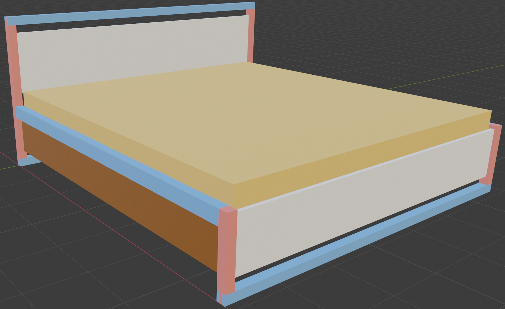
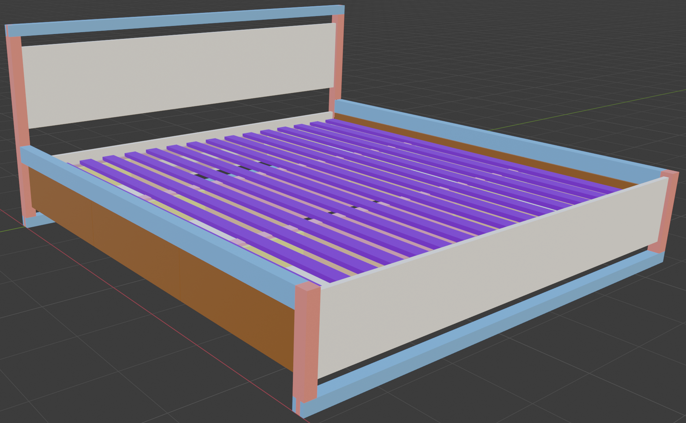
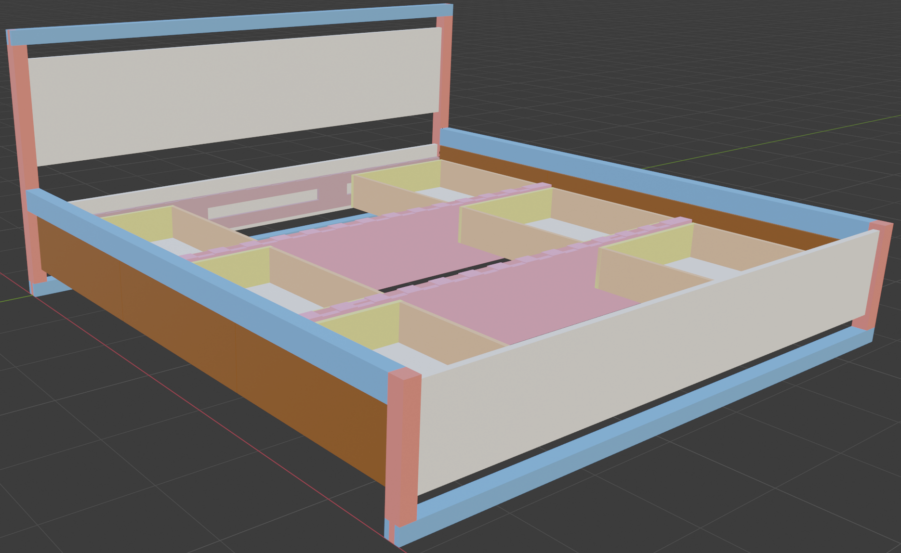

# Matera Bed

## Inspiration

Sean Yoo's Matera Bed

## Hardware

**Blum Movento**
<https://www.blum.com/us/en/products/runnersystems/movento/overview>

* Runners: 763.5330S
* Locks: T51.7601

Movento with Bluemotion/Tip-on

* Unit and Trigger: T60L7340
* Sync Adapters: T60.000D
* Sync Rod: T60L1118W

## Materials
The following materials are personal preference, but the design takes them into account as well.

|||
|-|-|
| Frame | Solid walnut |
| Panels | Solid walnut (consider veneered plywood) |
| Drawers | Solid walnut face, maple boxes, plywood bottom |
| Slats | Ash |
| Slat Support | Plywood |
|||

## Design Considerations

My current bed has a 12" mattress, so when I set out to reproduce the Matera bed, I wanted to reuse the mattress. Placing this behemoth of a mattress on the Matera bed would be a questionable decision with regards to aesthetics though. :)

In this design, the original Matera bed has been adapted, so a 12" thick mattress could *reasonably* be used, though an 8" mattress would arguably look much, much better. This design attempts to balance overall aesthetics against drawer utility; this is the main tradeoff of using a thicker mattress outside of looks. If you increase the height of the drawers, then the mattress must be raised, which makes the overall appearance akward as the mattress sits high on the frame. Conversely, if the mattress is sunk low into the frame, then the drawers become shallow and unusable.

To mitigate this limitation, the mattress slats have been rotated 90 degrees compared to traditional beds designs, which allows for more drawer depth because the slats are not bound to where the side rails are situated. Normally, the slats would be supported by a cleat on the side rails. This design uses alternate slat supports, which also double as connection points for the drawer guides.

Fortunately, you can make tweaks to meet your needs as it's a custom build. :D

## Techniques
1. Use proper breadboard construction for headboard & footboard panels. See: https://www.youtube.com/watch?v=TFn7JZmyFqk

2. Use a threaded insert + bolt to fasten the side rails to the header/footer legs. Accompany the bolt with two, chunky dowels for shear load support. The bolt fastener just acts to pull the rail and leg together, but shouldn't bear all the load by itself.

## Footer Notes
Panel Joinery
  - Use half-blind dowels for the mortise-tenon, breadboard construction. Locate the dowels towards the tenon's base, so they can be hidden behind drawer face.
  - Make the upper portion of the tenon fixed, so it can expand only downwards. This will allow any fastener/dowel coming into the leg from the bed's side rail to not interfere with the tenon's expansion since they'd be going into the fixed portion.

## Slat Support Notes
Pink denotes plywood in the Blender and screenshots below.

The amount of plywood designed is overkill for the middle two supports, but is also very simple to construct. A 2x4 with legs could be used instead to save some money, but also feels out of place on such a nice bed :). If you choose to modify the support design, just ensure the drawer guide connection points are sound.

Also note, the plywood adjacent to the headboard / footboard panels are not joined to each other. The plywood is supported by notches in the bed legs.

## Preview

Please open the Blender file to inspect the design in full 3D detail, but these screenshots are a useful preview. Note, the drawer faces are impossible to see in the screenshots, but they're present in the Blender.

Mattress

Slats

Underbelly
