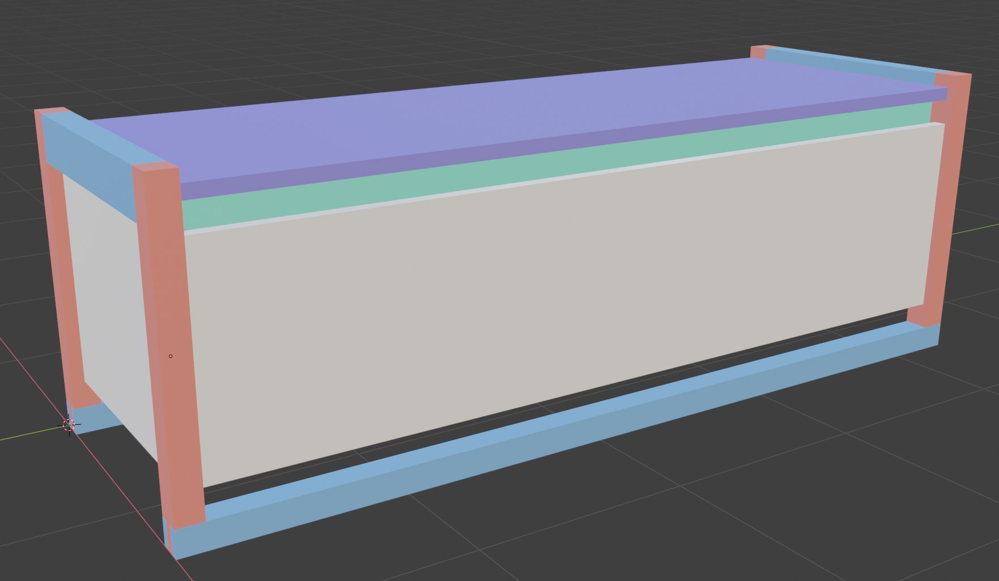

# Matera Bench

## Hardware

Sugatsune soft-down lid
<https://www.sugatsune.net/300PDF/125.pdf>

TODO: Find hinges

## Inspiration

Sean Yoo's Matera Bench

## 3D Preview

- Legs are 1-1/2" thick
- Panels are 3/4" thick
- Joints are all mortise-tenon with the exception of:
  - Bridles for bottom of legs
  - Rabbets for bottom panel

